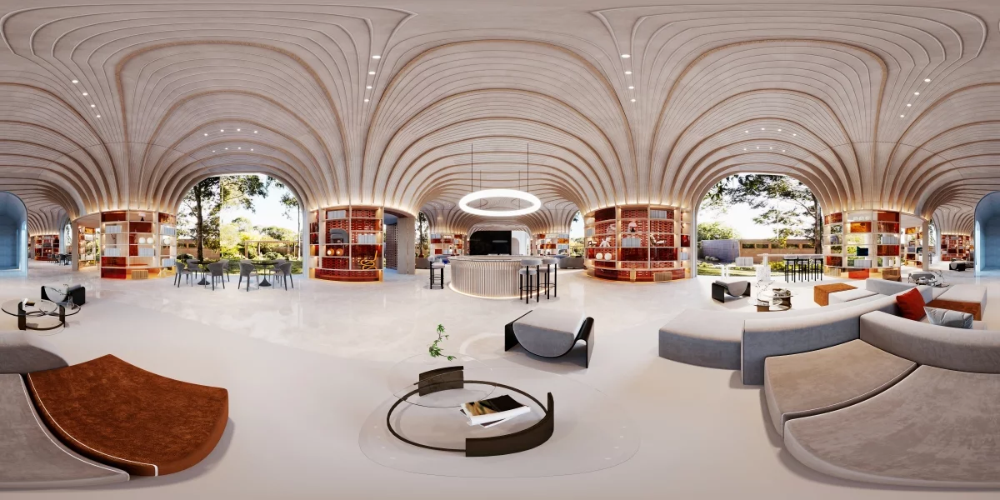
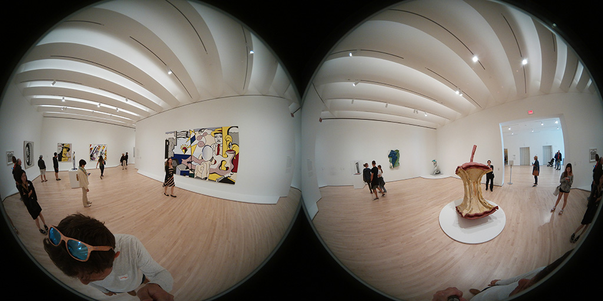

# ThreeHundredSixtyPlayer  [](https://github.com/kibotu/mobile-360-player/actions/workflows/android.yml) [](https://jitpack.io/#kibotu/mobile-360-player) [](https://android-arsenal.com/api?level=21) [](https://docs.gradle.org/current/release-notes) [](https://kotlinlang.org/)

Native OpenGLES 2.0 360 Degree Player

[](https://git.exozet.com/mobile-de/POC/android-360-player/raw/master/demo.gif)

# How to use

## As view

```xml
<?xml version="1.0" encoding="utf-8"?>
<androidx.coordinatorlayout.widget.CoordinatorLayout xmlns:android="http://schemas.android.com/apk/res/android"
    xmlns:app="http://schemas.android.com/apk/res-auto"
    android:id="@+id/root"
    android:layout_width="match_parent"
    android:layout_height="match_parent">

    <com.exozet.threehundredsixty.player.ThreeHundredSixtyPlayer
        android:id="@+id/threeHundredSixtyView"
        android:layout_width="0dp"
        android:layout_height="0dp"
        app:layout_constraintBottom_toBottomOf="parent"
        app:layout_constraintEnd_toEndOf="parent"
        app:layout_constraintStart_toStartOf="parent"
        app:layout_constraintTop_toTopOf="parent" />

</androidx.coordinatorlayout.widget.CoordinatorLayout>
```    
```kotlin    
private fun startThreeHundredSixtyPlayer(filename: String) = with(threeHundredSixtyView) {
    uri = parseAssetFile(filename)
    projectionMode = ThreeHundredSixtyPlayer.PROJECTION_MODE_SPHERE
    interactionMode = ThreeHundredSixtyPlayer.INTERACTIVE_MODE_MOTION_WITH_TOUCH
    showControls = true
}
```

## As Standalone Activity

Start 360 Degree Activity by passing bitmap file path for or an  bitmap

```kotlin               
ThreeHundredSixtyPlayerActivity.Builder
    .with(this)
    // (Note you require [READ_EXTERNAL_STORAGE Permission](https://developer.android.com/reference/android/Manifest.permission.html#READ_EXTERNAL_STORAGE))
    //.uri(parseInternalStorageFile("large.jpg"))
    .uri(parseAssetFile("large.jpg"))
    //.uri(parseExternalStorageFile("large.jpg"))
    //.uri(parseFile("large.jpg")) 
    .showControls() // default: false 
    .projectMode(ThreeHundredSixtyPlayer.PROJECTION_MODE_SPHERE) // default: PROJECTION_MODE_SPHERE
    .interactiveMode(ThreeHundredSixtyPlayer.INTERACTIVE_MODE_TOUCH) // default: INTERACTIVE_MODE_MOTION_WITH_TOUCH
    .startActivity()
```

## Projection Modes

#### [Equirectangular](https://en.wikipedia.org/wiki/Equirectangular_projection)



```kotlin
ThreeHundredSixtyPlayer.with(this)
    .projectMode(ThreeHundredSixtyPlayer.PROJECTION_MODE_SPHERE) // default
```

#### [Dual-Fisheye](https://en.wikipedia.org/wiki/Fisheye_lens)



```kotlin
ThreeHundredSixtyPlayer.with(this)
    .projectMode(ThreeHundredSixtyPlayer.PROJECTION_MODE_MULTI_FISH_EYE_HORIZONTAL) // or veritcal: PROJECTION_MODE_MULTI_FISH_EYE_VERTICAL
```

## Interaction Modes

* INTERACTIVE_MODE_TOUCH - Swipe Gestures
* INTERACTIVE_MODE_MOTION - Motion Sensors
* INTERACTIVE_MODE_MOTION_WITH_TOUCH - Both combined

# How to install (tbd)

```groovy
dependencyResolutionManagement {
    repositoriesMode.set(RepositoriesMode.FAIL_ON_PROJECT_REPOS)
    repositories {
        mavenCentral()
        maven { url 'https://jitpack.io' }
    }
}

dependencies {
    implementation 'com.exozet:ThreeHundertSixtyPlayer:-SNAPSHOT'
}
```

# GL_MAX_TEXTURE_SIZE

Player will log max supported texture size during surface view creation. Look out for **ThreeHundredSixtyPlayer**, e.g:
    
    ThreeHundredSixtyPlayer: GL_MAX_TEXTURE_SIZE 8192x8192    
    
# Changelog

* Supports being added as custom view
* Supports showing controls
* Supports motion configuration
* Supports motion sensors
* Supports swiping 
* Supports pinch zoom
* Supports orientation changes
* Supports automatically down scaling of images to GL_MAX_TEXTURE_SIZE
* Supports equirectangular textures 
* Supports dual-fish-eye-horizontal, dual-fish-eye-vertical textures 
* Supports loading indicator
* Supports loading from asset-folder
* Supports loading from internal storage
* Supports loading from external storage
* Supports loading from file 

## Contributors

[Jan Rabe](jan.rabe@kibotu.net)

# License
```
Copyright 2024 Jan Rabe

Licensed under the Apache License, Version 2.0 (the "License");
you may not use this file except in compliance with the License.
You may obtain a copy of the License at

    http://www.apache.org/licenses/LICENSE-2.0

Unless required by applicable law or agreed to in writing, software
distributed under the License is distributed on an "AS IS" BASIS,
WITHOUT WARRANTIES OR CONDITIONS OF ANY KIND, either express or implied.
See the License for the specific language governing permissions and
limitations under the License.
```
